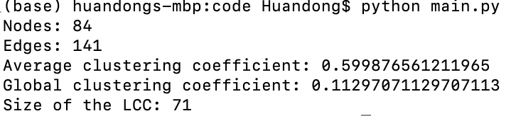
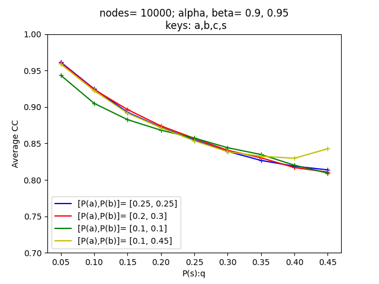

# The HyperType Model For Triangles in Networks
## Project introduction
In this project, we introduced the HyperType model that incorporate triangles, which is an extension of the Random Typing model designed by **Akoglu and Faloutsos** [[1]](#1). The codes here are the python implementations of the HyperType model.

Authors: Huandong Chang & Chuming Chen

Sponser: Nicole Eikmeier

## Run the code

User first downloads all the files in the src fold to the same directory on your computer. Here are the introductions of each file:

##### initialization.py:

This file contains all the helper functions to initialize the HyperType model and part of the helper functions to initialize the Typing model. User should not run this file.

##### Regularinitialization.py:

This file contains the remaining helper functions to initialize the Typing model besides those existing in initialization.py. User should not run this file.

##### main.py:

We can adjust parameters, such as probability list and the number of triples, in *main.py* to generate graphs using the HyperType model. Besides, if the user wants to combine the HyperType model with the Typing model, user can include the function called *initialization2D()* in the file. Then user should use the terminal to run *main.py* (*python main.py*). Then the information of the output graph, such as the number of nodes and the number of edges, will be returned in the terminal.

##### parameter.py

Since we can adjust the parameters in the HyperType model to better fit real-world dataset, it is important to understand how certain graph properties, such as average clustering coefficent (acc), change with varying parameters. We can use *parameter.py* to realize this. 

## Reference
<a id="1">[1]</a> 
L. Akoglu and C. Faloutsos. Rtg: a recursive realistic graph generator using random typing. In Joint European Conference on Machine Learning and Knowledge Discovery in Databases, pp. 13–28. 2009.
